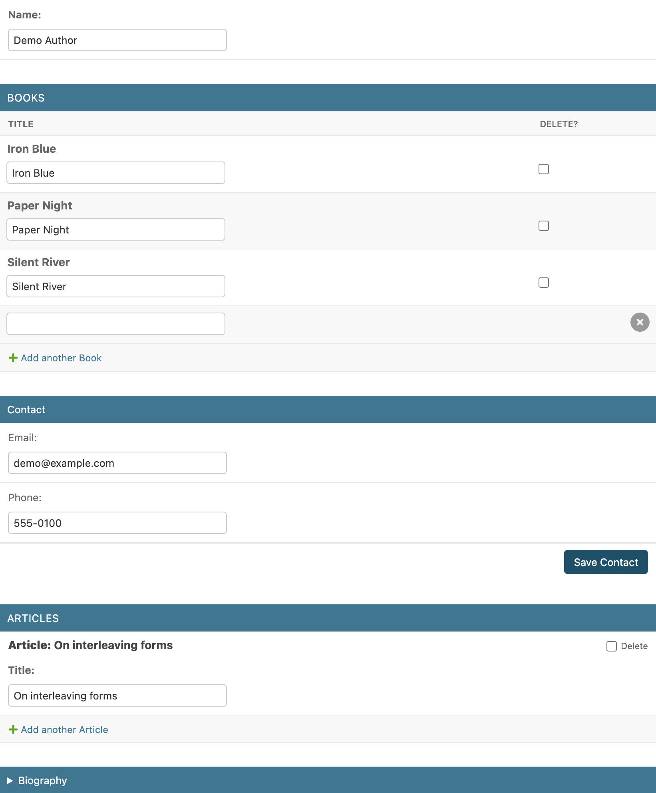
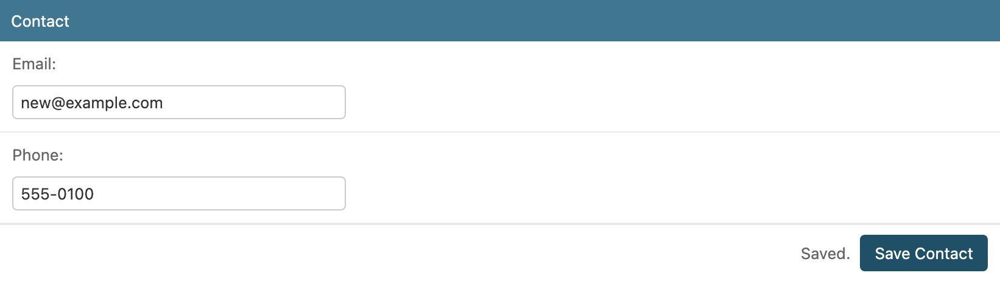

# django-admin-fieldsets-extra

[](https://github.com/rodolvbg/django-admin-fieldsets-extra/actions/workflows/pytest.yml)
[](https://pypi.org/project/django-admin-fieldsets-extra/)
[](https://pypi.org/project/django-admin-fieldsets-extra/)
[](https://pypi.org/project/django-admin-fieldsets-extra/)
[](https://pepy.tech/project/django-admin-fieldsets-extra)

Extras for Django admin fieldsets:

- **Interleave fieldsets and inlines** in the change form: put an inline
  right after the fields it belongs with, instead of always at the bottom.
- **Save a fieldset on its own** with a "Save Contact" button, without
  submitting or reloading the rest of the page.



- One ordered list replaces `fieldsets` + `inlines` (with or without
  inlines in it).
- No copy of Django's `change_form.html`: it only overrides its
  `field_sets` / `inline_field_sets` blocks, so it follows your Django
  version.
- Nothing changes in the inlines' DOM: Django's inline JS ("Add another",
  autocomplete, date pickers…) and inline templates work as usual.
- Works with [django-admin-inline-controls](https://github.com/rodolvbg/django-admin-inline-controls)
  (paginated / filterable inlines, a save button per inline).

## Install

```bash
pip install django-admin-fieldsets-extra
```

Add to `INSTALLED_APPS`:

```python
INSTALLED_APPS = [
    ...
    "django_admin_fieldsets_extra",
]
```

## Usage

```python
from django.contrib import admin

from django_admin_fieldsets_extra.mixins import FieldsetsExtraMixin


class BookInline(admin.TabularInline):
    model = Book


class ArticleInline(admin.StackedInline):
    model = Article


@admin.register(Author)
class AuthorAdmin(FieldsetsExtraMixin, admin.ModelAdmin):
    fieldsets_with_inlines = [
        (None, {"fields": ["name"]}),
        BookInline,
        ("Contact", {"fields": ["email", "phone"], "save_button": True}),
        ArticleInline,
        ("Biography", {"fields": ["bio"], "classes": ["collapse"]}),
    ]
```

Each entry is either a fieldset, exactly as in `ModelAdmin.fieldsets`, or an
inline class, as in `ModelAdmin.inlines`. They are rendered in that order.

- **`fieldsets` and `inlines` are derived from it** (in their relative
  order), so Django's admin checks and every hook that reads them keep
  working. Don't set them as well (`admin_fieldsets_extra.E003`).
- **Dynamic layouts:** override `get_fieldsets_with_inlines(request,
  obj=None)`; `get_fieldsets()` and `get_inlines()` follow it.
- **Permissions:** an inline the user can't see is simply left out, as
  in the regular change form.
- **Anything not in the layout** (e.g. extra fieldsets or inlines from your
  own `get_fieldsets()` / `get_inlines()`) is rendered after it.
- Without `fieldsets_with_inlines`, the mixin does nothing: the regular
  change form.

## Saving a fieldset

Add `"save_button": True` to a fieldset of the layout to give it a
**"Save Contact"** button (named after the fieldset; "Save" if it has no
name) that saves only its fields:

```python
(("Contact", {"fields": ["email", "phone"], "save_button": True}),)
```



`save_button` is an option of this package: it is removed before the
fieldset reaches Django (whose `Fieldset` rejects unknown options), so
`AuthorAdmin.fieldsets` and `get_fieldsets()` never contain it.

**How it works**

- The button is rendered by the server under the fieldset, only on existing
  objects and for users with change permission. It is hidden while the
  fieldset is collapsed.
- Only the fields inside that fieldset are sent (files included), to
  `<object_id>/fieldsets/<n>/save/`, `n` being its position in
  `get_fieldsets()`.
- The server builds `get_form(request, obj, fields=<its editable fields>)`
  on the object **as stored in the database**, validates it, calls
  `save_form()`, `save_model()` and `form.save_m2m()` in a transaction, and
  records the change in the history ("Changed Email and Phone."; nothing if
  nothing changed).
- The fieldset is re-rendered and swapped in place: field errors on their
  fields, form-wide errors (from `clean()`) above the fieldset, "Saved."
  next to the button on success. The rest of the page (other fieldsets,
  inlines, unsaved edits) is left untouched. A
  `fieldsets-extra:saved` event bubbles from the new fieldset.

**Caveats**

1. **Validation:** only this fieldset's fields are validated as fields, but
   `Model.clean()` / `ModelForm.clean()` still run, with the other fields'
   *stored* values. A rule that combines fields of two fieldsets sees the
   saved value of the other one, not what is unsaved on screen.
2. **`save_model(request, obj, form, change)` gets a form with only these
   fields.** If you override it and read other fields from
   `form.cleaned_data`, it won't work from this button. `save_related()`
   and the inlines' formsets are not called.
3. **Concurrency:** the object is re-read from the database right before
   saving, so the page's (possibly stale) values of other fields are never
   written back. As with the regular Save button, two people changing the
   same field at the same time: the last save wins.
4. Read-only fields are never saved; a fieldset with only read-only fields
   has no button (the endpoint answers 404).

## Customizing the template

The mixin sets `change_form_template` to
`admin/fieldsets_extra/change_form.html`, which extends
`admin/change_form.html`. For your own change form template, extend this
one instead:

```django



  <div class="my-inline">{{ block.super }}</div>

```

| Block | Contains |
|---|---|
| `field_sets` | The whole layout (falls back to Django's when there is none). |
| `layout_fieldset` | One fieldset (`fieldset`, and `item.index`, its position in `get_fieldsets()`); includes `admin/fieldsets_extra/includes/fieldset.html`. |
| `layout_inline` | One inline (`inline_admin_formset`). |
| `inline_field_sets` | Empty when there is a layout (the inlines are already rendered). |

`admin/fieldsets_extra/includes/fieldset.html` renders one fieldset
and, if it has one, its save button. Its blocks: `non_field_errors`,
`fieldset`, `save_bar` and `save_label`. It is also the save endpoint's
response (`fieldset_response.html`, block `response`; set
`fieldset_save_response_template` on the `ModelAdmin` to use another one).
The JS replaces the `fieldset-with-save` container by its id and relies on
the `data-fieldset-save-url` attribute and the `data-fieldset-save` button:
keep them when overriding blocks.

The layout is also in the context as `fieldsets_with_inlines`: a list of
items with `is_inline`, `fieldset`, `index`, `inline_admin_formset`,
`save_url` and `save_label`.
`get_layout_items()` builds it, if you need to change how the layout is
matched to the form.

## With django-admin-inline-controls

Both mixins go on the `ModelAdmin`, `InlineControlsAdminMixin` first:

```python
from django_admin_inline_controls.mixins import (
    InlineControlsAdminMixin,
    InlineControlsMixin,
)


class BookInline(InlineControlsMixin, admin.TabularInline):
    model = Book
    inline_per_page = 20
    inline_save_button = True


@admin.register(Author)
class AuthorAdmin(InlineControlsAdminMixin, FieldsetsExtraMixin, admin.ModelAdmin):
    fieldsets_with_inlines = [
        (None, {"fields": ["name"]}),
        BookInline,
        (
            "Contact",
            {"fields": ["email", "phone"], "classes": ["inline-controls-save"]},
        ),
    ]
```

Neither package knows about the other: the controls are part of each
inline's own template, and the fieldset save buttons are attached to
fieldsets by their class, wherever the layout puts them. Fieldsets keep
their position in `get_fieldsets()`, which is how the save endpoint finds
them.

## System checks

| ID | Problem |
|---|---|
| `admin_fieldsets_extra.E001` | `fieldsets_with_inlines` is not a list or tuple. |
| `admin_fieldsets_extra.E002` | An entry is neither a `(name, {"fields": ...})` fieldset nor an inline class. |
| `admin_fieldsets_extra.E003` | `fieldsets` or `inlines` is set as well. |
| `admin_fieldsets_extra.E004` | A fieldset's `save_button` is not `True` or `False`. |

## Demo

```bash
cd example
python manage.py migrate
python manage.py seed_demo      # admin/admin + an author with books
python manage.py runserver
```

## Compatibility

Django 4.2 – 6.1, Python 3.10+.

## License

MIT
