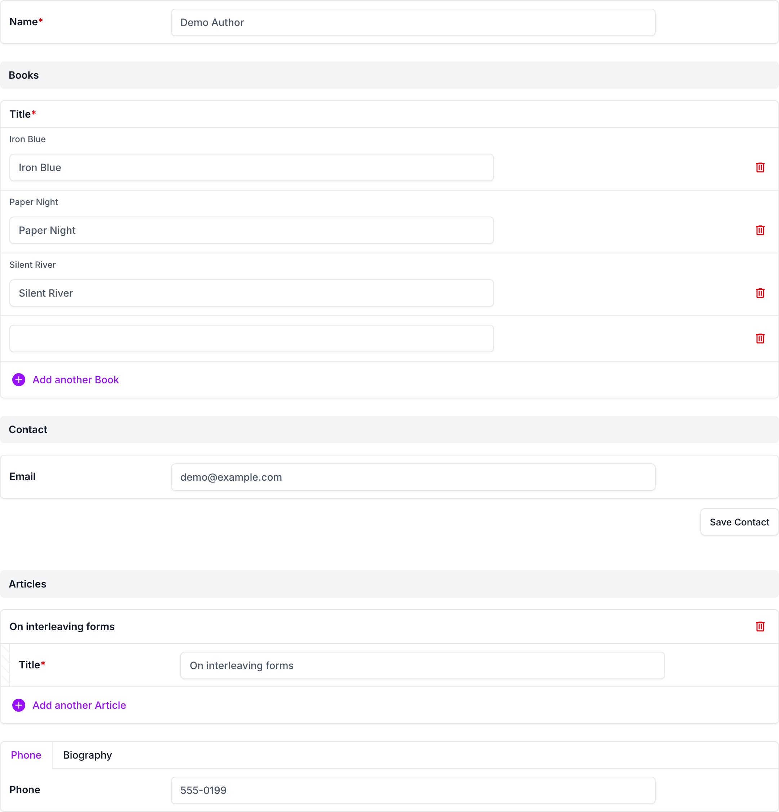
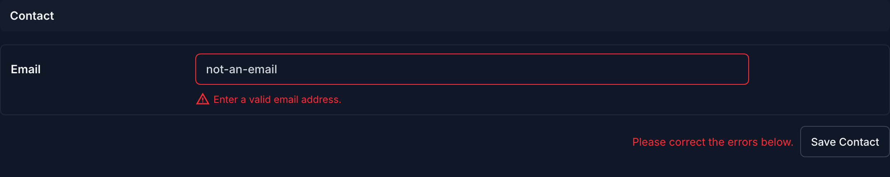

# django-admin-fieldsets-extra with django-unfold

## Usage

```bash
pip install django-admin-fieldsets-extra[unfold]
```

```python
from unfold.admin import ModelAdmin, TabularInline
from django_admin_fieldsets_extra.contrib.unfold import UnfoldFieldsetsExtraMixin


class BookInline(TabularInline):
    model = Book


@admin.register(Author)
class AuthorAdmin(UnfoldFieldsetsExtraMixin, ModelAdmin):
    fieldsets_with_inlines = [
        (None, {"fields": ["name"]}),
        BookInline,
        ("Contact", {"fields": ["email"], "save_button": True}),
        ("Phone", {"fields": ["phone"], "classes": ["tab"]}),
        ("Biography", {"fields": ["bio"], "classes": ["tab"]}),
    ]
```

The layout, the save buttons (with Unfold's colors, light and dark) and
Unfold's collapsible fieldsets work as usual. Unfold's tab fieldsets
(`"classes": ["tab"]`) are rendered as its tabs, all of them where the
first one is in the layout; they can't have a `save_button`
(`admin_fieldsets_extra.E101`). The template is
`admin/fieldsets_extra/unfold/change_form.html`, which extends
`admin/fieldsets_extra/change_form.html`.

## Screenshots

Fieldsets and inlines interleaved, a fieldset with its save button, and
Unfold's tab fieldsets where the first of them is in the layout:



A fieldset saved on its own with an invalid value, in dark mode:



## Demo

```bash
cd example
DJANGO_SETTINGS_MODULE=example.settings_unfold python manage.py runserver
```

## Compatibility

django-unfold 0.108+ (Django 5.2+, Python 3.12+).
